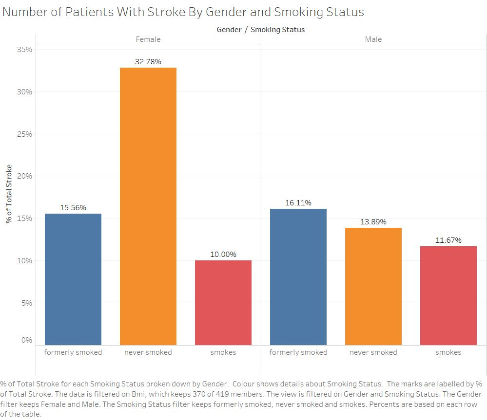

```{r setup, include=FALSE}
knitr::opts_chunk$set(echo = TRUE)

rm(list=ls()) #clear current environment to start afresh

getwd()

# List of installed packages (comment out once you have installed)

# Run libraries
library(ggplot2)
library(glmnet)
library(tidyverse)
library(tidyr) # for output
library(broom) # to tidy data
library(gtools) # convert p-value to significance code (*, **, ***)
library(dplyr)
library(gridExtra) # to organize plots
library(PerformanceAnalytics) # correlation matrix
library(kableExtra)
library(car)

# Automatically add reference entries of R packages to 'packages.bib'

knitr::write_bib(c(.packages(), "bookdown"), file = "packages.bib")

# importing the data
data = read.csv("./datasets/healthcare-dataset-stroke-data.csv")

```
# I. Introduction

## Background of Study and Problem Description
With a global mortality rate of 5.5 million people annually, Stroke is the world’s second leading cause of death (Donkor, 2018). Referred by the World Health Organization as the ‘incoming epidemic of the 21st century’ (Sarikaya et al., 2015), stroke is considered to be a very common disease, happening in one out of six people (Phipps & Cronin, 2020). In addition to its high fatality and commonness, Stroke is also the world’s third leading cause of disability (Johnson, Onuma, Owolabi & Sachdev, 2016), with over  50 % of stroke survivors end up being disabled (Donkor, 2018). 

In an attempt to elucidate the basic reasons for stroke, there is a common perception that people who are overweight or obese (those with a high value of BMI) would have a higher tendency to contract stroke. A frequent research made by Yu et al. (2020) showed that BMI does modify the association between serum HDL cholesterol and stroke in a hypertensive population. However, the fact that the research positions BMI as an additional external factor does not exactly prove that BMI as its own has a direct relationship with the possibility of someone having a stroke. Instead, it actually signifies that there are other external factors that would affect the chances of someone having a stroke. 

This research aims to prove the reliability of the statement on which BMI affects the probability of having a stroke, while also attempting to shed light on the external demographic variables that account for the occurrence of stroke. The results of this study would be beneficial for future medical researchers and the common people to fully understand the factors that actually affect stroke. In order to ensure the reliability of the research, statistical data and methodologies will be used throughout the reporting process of the research

Thus, the research explores the following research questions:

RQ1 : Does BMI affect the incidence of stroke?
The research will be investigating the relationship between the occurrence of stroke and the BMI levels in order to provide a reliable truth behind the common perception that Stroke affects the incidence of stroke.

RQ2 : Do certain personal lifestyles/demographic variables (gender, smoking status, living conditions) affect the incidence of stroke?
This research will also be looking into the relationship between stroke and the other demographic variables such as, but not limited to, gender, smoking status, living conditions in order to provide the factors that actually affect trigger stroke incidents.


# II. Data and Methodology

## Data
The dataset contains information on 5110 individuals, particularly a total of 10 available variables of their health status, demographic, as well as lifestyle conditions and habits. It was extracted on 30th April, 2021, which can be obtained from https://www.kaggle.com/fedesoriano/stroke-prediction-dataset.

The variables in the original dataset are $Stroke$, $BMI$, $Hypertension$, $HeartDisease$, $SmokingStatus$, $Gender$, $ever\_married$, $work\_type$, $ResidenceType$,  $AVGGlucose$ and  $Age$. However, only 8 variables other than $Stroke$ itself are included in the dataset for this study as we found that the categorical variable of $work\_type$ and $ever\_married$ to be less insightful in our analysis on stroke effectors.

To test the hypothesis that $bmi$ does not affect $stroke$ and there are better predictors for $stroke$, dataset with 11 variables. There were 5110 observations and 11 observations within the dataset. The dataset was extracted on 30th April, 2021, which can be obtained from https://www.kaggle.com/fedesoriano/stroke-prediction-dataset.

The variables in the original dataset are $stroke$, $bmi$, $hypertension$, $heart\_disease$, $smoking\_status$, $gender$, $ever\_married$, $work\_type$, $Residence\_type$,  $avg\_glucose\_level$ and  $age$. However, only 9 variables are included in the dataset for this study.

The variables used are as follows: 

| Variable | Description |
|------------|-------------|
| 1. $Stroke$ | 1 = Ever had a stroke incident in their lives, 0 = Have never had any stroke incident |
| 2. $AVGGlucose$ | Average Glucose Level in Blood ($mg/dl$) |
| 3. $BMI$ | Body Mass Index. Body mass in proportion to height ($kg/m^2$) |
| 4. $HeartDisease$ | 1 = Patient with heart disease, 0 = Patient without heart disease |
| 5. $Hypertension$ | 1 = Patient with hypertension, 0 = Patient without hypertension |
| 6. $Smoking$ | Smoking status of patient. Divided into 3 categories: "never smoked", "formerly smoked", and "smokes" |
| 7. $Gender$ | "Male" or "Female" |
| 8. $Age$ | Patient's Age |
| 9. $ResidenceType$ | "Rural" or "Urban" |


### Data cleaning
Upon reviewing the dataset, some adjustments need to be made to the data before it can be used.

There are missing values present in $Bmi$ column within the dataset, with them being populated with the word "N/A". Since $Bmi$ measures a continuous data, a character data type is not suitable, thus, violating the domain integrity for $Bmi$. To address this issue, the proportion of observations that has N/A's for $Bmi$ were looked into. Since there was only $n(bmi_{unknown})=201$, all rows with N/A's were removed, leaving us with sufficient sample amount to work with and the values in $Bmi$ are converted into numerical data.

The $Gender$ variable are initially divided into three categories: "male", "female", and "others". However, there is only one observation that contains the value "others". Due to it being an outlier, the particular observation (the whole row) was removed.

Similar to $Gender$, Smoking Status is also a categorical variable, with an additional category "Unknown" on top of the aforementioned categories. Although there are  $n(smokingstatus_{unknown})=1544$ observations that contains "Unknown", consideration to remove them was made. Since the dataset is large enough to not cause bias, and the objective is to get a better insights on the impact of smoking on stroke, the "Unknown" category was removed.


Lastly, the id column was removed as it was not needed for the analysis of this study.
```{r data cleaning}
# data cleaning
print(sum(data$bmi == "N/A"))  # 201 rows with no BMI
print(sum(data$gender == "Other"))  # only ONE row, so we can omit it to reduce the model's complexity
print(sum(data$smoking_status == "Unknown"))  # 1544 rows with unknown smoking status

# total rows removed
print(sum(data$bmi == "N/A" | data$gender == "Other" | data$smoking_status == "Unknown"))
# 1685 rows will be removed, leaving 3425 rows or around 67% of the data

data = data[!(data$bmi == "N/A"), ]  # remove bmi which is N/A
data = data[!(data$gender == "Other"), ]  # remove the only row with 'Other' gender
data = data[!(data$smoking_status == "Unknown"), ]  # remove unknown smoking status

# bmi is in a string format, we need to convert to double
data = transform(data, bmi = as.numeric(bmi))

#remove id column
sapply(data, class)
data = data[,-1]
```


### Summary statistics 

Below is the summary statistics for the dataset.
```{r summary statistics, eval=FALSE}
summary(data)
summary(data) %>%
  kable(digits = 3, caption = "Summary statistics of the dataset", table.attr="style=\"color:black;\"") %>% 
  kable_styling(full_width = TRUE)
```

## Methodology

For analysis of categorical dependent variables such as $Stroke$, $Hypertension$, and $HeartDisease$, we modelled them using Logistic Regression instead of using the standard OLS method. A Logistics Regression is preferred before OLS due to four major reasons. First, binary choice problem. The binary choice problem is an issue when some of the fitted values violates the domain integrity constraint of [0,1] for probability. Secondly, binary data do not have normal distribution, on the other hand, OLS follows a normal distribution which is only suitable for predicting continuous variable. As a result, the when performing ols on binary data, the residual plots will show positive and negative residuals. Since the error (residuals) are not normally distributed because errors are unexplained part of the dependent variable y, which both of them are binary which leads to the third problem. Since the errors are binary in nature, the OLS will no longer BLUE(best linear unbiased estimator). Therefore, the t-tests and F-test will no longer show a significant result. Lastly, for binary variable, instead of lookin at the unit change of the variable, looking at their likelihood of the event occuring is more realistic. Thus, the logistic distribution is a better choice to predict $Stroke$, $Hypertension$, and $HeartDisease$. 

Not only we model $Stroke$ as a dependent variable, we found the need to also model other variables that may affect $Stroke$, such as $Hypertension$, $HeartDisease$ and $AVGGlucose$ as dependent variables in order to find their explanatory variables which implies to be indirectly affecting probability of stroke occurence. In other words, whatever explanatory variables that are significant in predicting the independent variables of $Stroke$, may be indirectly related to $Stroke$ even if it is insignificant in the prediction model itself. This is to explain the relationship occuring in our dataset, especially to answer the question of "Does a person's BMI affect the likelihood of getting a stroke incident?".

Since there are 8 independent variables, stepwise selection method is used to achieve a parsimonious model. The stepwise selection incorporates both forward and backward selection technique. Beginning from no variables, for each step, one variable is added to the model. Then it is compared with all of the other candidate predictors in the model are compared based both AIC and BIC standard. The variable that is insignificant is then removed from the model.

For continuous dependant variables we used the Ordinary Least Squares (OLS) method. Regularization were used to refine our final prediction model for probability of stroke incidence. Computation of RMSE and MSE were conducted and compared among our models (predicting $Stroke$) to evaluate which model would be the best in this case. Bias and variance were also balanced by looking at the errors of both train and test data. 

# III. Visualization (Christin)

```{r correlation and scatter plot, fig.align = 'center', out.width = '100%', echo = FALSE}
#correlation and scatter plot
chart.Correlation(data[sapply(data, function(x) !is.character(x))], histogram = TRUE, method = "pearson", pch=19)
```
The matrix above are scatter plots and correlations showing the relationship between all the variables. According to the matrix above, all of our variables, except $BMI$, has weak positive relationship with each other as their strength with the dependent variable $Stroke$ are between 0.1 and 0.3. This mean that there will be no multicollinearity problem among the predictors such as $Age$, $Hypertension$, $AVGGlucose$, and $HeartDisease$ when performing regression. However, since $BMI$ seems to have weak relationship with $AVGGlucose$ and$hypertension$, $bmi$ might have an indirect effect to predicting $Stroke$. Thus, all of them except $BMI$ can be used to predict $Stroke$ for regression and further analysis are required to check for indirect effect of $BMI$ against $Stroke$.

```{r visualizing avg_glucose_level over bmi, echo = FALSE}

#plotting avgglucoselvl ~ bmi
cor.val = round(cor(data$bmi, data$avg_glucose_level), 2)
cor.label = paste0("Correlation: ", cor.val)
ggplot(data,
       aes(x = bmi,
           y = avg_glucose_level)) +
    geom_point() +
    annotate(x = 75, y = 300,  geom = "text", 
             label = cor.label, size = 5) +
    labs(x = "BMI", 
         y = "Average Glucose Level") +
    ggtitle("Scatterplot of Average Glucose Level VS BMI")
```
An individual scatterplot of $BMI$ on $AVGGlucose$ is plotted to get a better view. There seems to be extremely weak positive linear relationship between the two variables since their correlation is between 0.1 and 0.3.

```{r boxplot of hypertension ~ bmi and stroke ~ bmi, echo = FALSE}
# box plot of hypertension ~ bmi
plotData = data
plotData$hypertension <-factor(plotData$hypertension,labels=c("No","Yes"))
hyperbmi.bp = ggplot(plotData, aes(x = bmi, y = hypertension, fill = hypertension)) + 
    geom_boxplot() +
    coord_flip() +
    labs(x = "BMI",
         y = "Hypertension") +
    ggtitle("Boxplot Comparing BMI Level on Hypertension")

# box plot of stroke ~ bmi
plotData$stroke <- factor(plotData$stroke,labels=c("No","Yes"))
strokebmi.bp = ggplot(plotData, aes(x = bmi, y = stroke, fill = stroke)) + 
    geom_boxplot() +
    coord_flip() +
    labs(x = "BMI",
         y = "Stroke") +
    ggtitle("Boxplot Comparing BMI Level on Stroke")

# put 2 plots in 1 row
grid.arrange(hyperbmi.bp, strokebmi.bp, ncol=2)
```
From the boxplot above, it shows that there is slight difference in $BMI$ level between individual who had stroke and individual who does not. Like hypertension, this is also the case for stroke. Hence, it can be concluded from the plots that BMI is not significant in predicting hypertension and stroke. To confirm this findings, series of formal tests is conducted.

```{r visualisation for 2 categorical variables, fig.align = 'center', echo = FALSE}
# barchart

```

# IV. Analysis Results

## Training-test split 
Before proceeding with our model development stage, we split the dataset into training and test sets of 75%:25% ratio. All estimations were done using the training set, and test set was used for prediction accuracy measurements.  
```{r splitdata}

# Split into train and test sets
set.seed(123)
testIndices = sample(1:3425, nrow(data) * 0.25, replace=F)
trainData = data[-testIndices, ]
testData = data[testIndices, ]
```

## Model Development

### Does the Body Mass Index (BMI) Affect the Probability of Someone Having a Stroke Incident?

To answer this, we initially regressed $Stroke$ againts $BMI$ using logistics regression and assess its individual significance. 

\begin{equation}
$$Stroke = \alpha + \beta_1BMI + \epsilon_i$$
\end{equation}

```{r logistic regression model for stroke on bmi, echo = FALSE}
# create model stroke ~ bmi
modelBMI = glm(stroke ~ bmi, trainData, family="binomial")
summary(modelBMI) 

modelBMI %>%
  tidy() %>%
  mutate(sig = stars.pval(p.value)) %>%
  kable(digits = 3, caption = "Logstic Model 2") %>%
  kable_styling(full_width = TRUE)
```

$$H_0: \beta_1 = 0$$
$$H_1: \beta_1 ≠ 0$$
Significance level = 5%

p-value $>$ $\alpha$, do not reject the null.

Based on the p-value (0.638) produced from model (1) above, we can see that BMI actually does not significantly affect stroke incidents

Then we attempted to see whether results would differ after adding other variables into the model, while also looking at the other factors that may be significant in predicting stroke incidents. Stepwise selection method were used to identify the variables to be included in order to achieve a parsimonious model under two(2) different penalties: Akaike Information Criteria (AIC) and Bayesian Information Criteria (BIC) as illustrated in the table below:

```{r logistic regression model selection}

# model stroke ~ gender + age + hypertension + heart_disease + Residence_type + avg_glucose_level + smoking_status + bmi
modelStroke = glm(stroke ~ gender + age + hypertension + heart_disease + Residence_type + avg_glucose_level + smoking_status + bmi,trainData, family="binomial")
summary(modelStroke)

# To achieve a model with only significant variables that affect stroke, we can 
# use stepwise selection method, whilst trying both AIC and BIC.
step.fit.aic.stroke = step(modelStroke, direction = "both", criterion = AIC)

# age,hypertension,heart disease, avg glucose lvl
summary(step.fit.aic.stroke)

step.fit.bic.stroke = step(modelStroke, k=log(nrow(trainData)), direction = "both", criterion = BIC)
summary(step.fit.bic.stroke) #age, avg glucose level
```
_Figure 4.1. Variables Affecting Incidence of Stroke_

| Explanatory Variable (X)          | p-value              | Significance Level | Stepwise: AIC | Stepwise: BIC |
|-----------------------------------|----------------------|--------------------|---------------|---------------|
| Age                               | $< 2 e^{-16}$        | 0.05               | Included      | Excluded      |
| Hypertension                      | $0.00331$            | 0.05               | Included      | Excluded      |
| HeartDisease                      | $0.04782$            | 0.05               | Included      | Excluded      |
| Average Glucose Level             | $0.00986$            | 0.05               | Included      | Included      |
| Smoking: "Never Smoked"; "Smokes" | $0.53055$; $0.39111$ | 0.05               | Excluded      | Excluded      |
| Gender : "Male"                   | $0.95952$            | 0.05               | Excluded      | Excluded      |
| Residence Type: Urban             | $0.52113$            | 0.05               | Excluded      | Excluded      |
| BMI                               | $0.87896$            | 0.05               | Excluded      | Excluded      |


with estimated coefficients are reported below (Eq.2. AIC Selection; Eq.3. BIC Selection)

$Stroke = -7.3188 + 0.06465Age + 0.51158Hypertension + 0.49737HeartDisease + 0.004465AvgGlucose$ (2) 
$Stroke = -7.544819 + 0.069593Age + 0.005271AvgGlucose$ (3) 

$Age$ and $AVGGlucose$ seems to be the inevitable factors that correlate with probability of stroke occurence as they are still significant upon stricter penalty of BIC. Whereas $Hypertension$ and $HeartDisease$ seem to only be included in the model penalised with AIC.

##### Linear Regression (OLS)
It is clear that *BMI is insignificant* in all 3 models that estimates probability of $Stroke$ (eq.(1),(2),(3)). However, we discovered that BMI has indications to be indirectly affecting stroke incidence. Following the AIC subset selection and the Lasso regularization, we individually regressed $AVGGlucose$, $Hypertension$ and $HeartDisease$ againts $BMI$ and found $BMI$ to have positive relationship with $AVGGlucose$ and $Hypertension$ but not with $HeartDisease$ 

$AVGGlucose = 78.1764 + 1.0006BMI$ (4)
$Hypertension = -3.503 + 0.0498BMI$ (5)


```{r ols}
# We can really see that BMI does not significantly affect incidence of stroke in
# all possible models (AIC,BIC), but lets see if BMI affects hypertension, glucose level, heart disease
modelGlucoseBMI = lm(avg_glucose_level~ bmi, data = trainData)
summary(modelGlucoseBMI)  #IT DOES!!!!
resid_glucose_BMI <- residuals(modelGlucoseBMI)
plot(resid_glucose_BMI) #residuals seem to have neither patterns nor variations, Homoskedastic.

modelHypertensionBMI = glm(hypertension ~ bmi, trainData, family="binomial")
summary(modelHypertensionBMI)  #YES IT DOES

modelHeartdiseaseBMI = glm(heart_disease ~ bmi, trainData, family="binomial")
summary(modelHeartdiseaseBMI)  #Nope
```
_Figure 4.2. BMI Effects_
| Dependent Variable (Y) | Explanatory Variable (X) | Estimated Coefficient ($\hat{\beta}$| p-value | Significance Level|
|--------------------------|------------------------|-------------------------------------|---------|-------------------|
| Average Glucose Level |BMI| 1.0006 | $5.86e^{-15}$ | 0.05 |
| Hypertension |BMI| 0.0049811 | $1.09e^{-11}$ | 0.05 |
| Heart Disease |BMI| 0.004245 | $0.704$ | 0.05 |

Age was excluded because of the assumption that BMI should be self-regulated despite of any age a person is (BMI is merely a basic measure of body composition and not a medical occurence that changes due to aging process). BMI, however, is directly proportionate to the chances of having hypertension and high average glucose level in the blood stream which affects the probability of stroke occuring. On the other hand, there is no statistical evidence that a person's BMI affects his/her chances of getting a heart disease. In other words, there exist *indirect relationship between BMI and stroke incidence*, via $AVGGlucose$, $Hypertension$. 

### What Other Variables Indirectly Affect Stroke Incidence?

For each of the explanatory variables that have significance in predicting $Stroke$, we regress them as independent variables againts all possible variables available in our dataset (other than stroke itself) and pick up the significant regressors using another stepwise selection method with BIC as its penalty this time. Results are reported as the following:

$Hypertension = -7.11088 + 0.051249Age + 0.00438AvgGlucose + 0.05786BMI$ (7)

$HeartDisease = -8.353 + 0.077662Age + 0.004838AvgGlucose + 0.8164Male$ (8)

$AvgGlucose = 58.346 + 0.46157Age + 15.30035Hypertension + 18.1395HeartDisease + 0.81214BMI$ (9)

$BMI$ and $Age$ has a positive relationship with the chances of having hypertension as well as $AvgGlucose$. $Hypertension$ and $AvgGlucose$ are inter-related (they affect each other) and there exist a cross relationship between $AvgGlucose$ and $HeartDisease$. There is also statistical evidence that men have higher chances of getting heart disease.

```{r, echo = FALSE}
# Now we see other possible variables that may increase the likelihood of hypertension, heart disease or increase your glucose level
modelHypertension = glm(hypertension ~ .-stroke, trainData, family="binomial")
step.fit.aic.hyper = step(modelHypertension, direction = "both")
summary(step.fit.aic.hyper)
step.fit.bic.hyper = step(modelHypertension, k=log(nrow(trainData)), direction = "both")
summary(step.fit.bic.hyper)  # bmi and age positively affect hypertension

modelHeartdisease = glm(heart_disease ~ .-stroke, trainData, family="binomial")
step.fit.aic.heart = step(modelHeartdisease, direction = "both")
summary(step.fit.aic.heart)
step.fit.bic.heart = step(modelHeartdisease, k=log(nrow(trainData)), direction = "both")
summary(step.fit.bic.heart) #avg glucose level, gender=Male and age positively affect heartdisease

modelGlucose = lm(avg_glucose_level ~ .-stroke, trainData, family="binomial")
resid_glucose <- residuals(modelGlucose)
plot(resid_glucose) #residuals seem to have neither patterns nor variations, Homoskedastic. 
step.fit.aic.gluc = step(modelGlucose, direction = "both")
summary(step.fit.aic.gluc)
step.fit.bic.gluc = step(modelGlucose, k=log(nrow(trainData)), direction = "both")
summary(step.fit.bic.gluc)  # bmi, age, hypertension, heart disease positively affect glucose level

# hypertension, heart disease and glucose level themselves affect each other (crossly related)

car::vif(modelGlucose)  %>% 
  kable(digits = 3, caption = "VIF for Glucose Model") %>%
  kable_styling(full_width = TRUE)
```

_Figure 4.3. Flow Chart Summary of Relationships_

```{r}
#Insert image for flow chart
```


### Predicting the Probability of Stroke Incidence

#### 4.1. Estimation

##### Logistic Regression
In estimating the model to predict $Stroke$, we initially included all the significant variables: $Age$, $Hypertension$ and $AvgGlucose$ as well as the identified variables that indirectly affect stroke as interaction terms such as the following:

$Stroke = \alpha + \beta_1Age + \beta_2Hypertension + \beta_3AvgGlucose + \beta_4Hypertension*BMI + \beta_5AvgGlucose*BMI + \epsilon_i$ (10)

_Figure 4.4. Estimations of Logistic Model (Interaction Term Included)_
```{r strokeRefinedModel, echo = FALSE}
# Now let us create a model to predict the probability of stroke occurrence
modelStrokeFinal = glm(stroke ~ age + hypertension + avg_glucose_level + hypertension*bmi + avg_glucose_level*bmi, data = trainData, family="binomial")

summary(modelStrokeFinal)

# tabulated
modelStrokeFinal%>% 
  tidy() %>%
  mutate(sig = stars.pval(p.value)) %>%
  kable(digits = 3, caption = "Final Model Output") %>%
  kable_styling(full_width = TRUE)


```

Next, we checked whether multicollinearity exists in eq.10. 

```{r strokeRefinedModel - VIF, echo = FALSE}
# measure vif
car::vif(modelStrokeFinal) %>% 
  kable(digits = 3, caption = "VIF for Final Model") %>%
  kable_styling(full_width = TRUE)
```
According to the VIF values, there appears to be extreme multicollinearity within the model as they exceed far beyond the value of $10.0.$ for most of the explanatory variables. Hence, we decided to remove the interaction terms to predict stroke denoted by:

_Model 1_
$Stroke = \alpha + \beta_1Age + \beta_2Hypertension + \beta_3AvgGlucose + \epsilon_i$ (11)

_Figure 4.5. Estimations of Logistic Model (Interaction Term Excluded)_
```{r strokeRefinedFinalModel - revised, echo = FALSE}
strokeRefinedFinalModel = glm(stroke ~ age + hypertension + avg_glucose_level, data = trainData, family="binomial")

summary(strokeRefinedFinalModel)
# output tabulated
strokeRefinedFinalModel %>% 
  tidy() %>%
  mutate(sig = stars.pval(p.value)) %>%
  kable(digits = 3, caption = "Summary of Final Adjusted Model") %>%
  kable_styling(full_width = TRUE)
```
After removing the interaction term, all of our independent variables are significant. We call this _Model 1_. To make sure that there is no multicollinearity present, another VIF will be performed on the revised model (11). 

```{r revisedfinalmodel vif, echo=FALSE}
# measure vif
car::vif(strokeRefinedFinalModel) %>% 
  kable(digits = 3, caption = "VIF for Final Adjusted Model") %>%
  kable_styling(full_width = TRUE)

# beta 2
((exp(-7.352+0.606)/(1+exp(-7.352+0.606))))
```
Based on the VIF values, we could see that _Model 1_ no longer has multicollinearity as they are all near value of $1.0.$. 

#### Regularized Regression
Next, we incorporated the regularization method to retrain our data in order to arrive at our final model that is robust and parsimonious.  

```{r regularized regression, echo = FALSE, out.width= '50%'}
# Standardized
x <- model.matrix(stroke ~ gender + age + hypertension + heart_disease + Residence_type + 
                       avg_glucose_level + smoking_status + bmi, data)[ , -1]  # to discard the intercept
y <- data$stroke
# dim(x)

# use a random set of numbers
set.seed(123)
train <- sample(1:nrow(x), nrow(x)/2)
test <- -train
y.test <- y[test]
y.train <- y[train]

# lambda's to try out
grid <- 10^seq(10, -2, length = 100)

## Penalty
# Ridge
ridge.mod <- glmnet(x, y, alpha = 0, lambda = grid)  #coef(), predict() in glmnet package
# ridge.mod is the trained ridge regression model
# x and y must be pass separately, cannot do y ~ x.
# alpha=0: fit a ridge regression model
# alpha=1: fit a lasso model
plot(ridge.mod, xvar = "lambda", main = "Ridge penalty")

# Lasso
lasso.mod <- glmnet(x[train, ], y[train], alpha = 1, lambda = grid)    # alpha = 1: lasso
plot(lasso.mod, xvar = "lambda", main = "Lasso penalty")

```


```{r regularization - CV, echo = FALSE, out.width= '50%'}
## Cross-validation (Scientific) - Perform a 10-fold cross-validation to select lambda 
# RIDGE
set.seed(123)
cv.out <- cv.glmnet(x[train, ], y[train], alpha = 0, type.measure = "deviance", family = "binomial") # 10-fold cv be default
cv.out
#type.measure="mse" if regression
#type.measure="deviance"
#family="gaussian" if linear regression
#family="binomial" if logistic regression
plot.ridgecv <- plot(cv.out, main = "Deviance of a range of 10-fold cv-lambda") # choose (optimal) cv-lambda that has the lowest (minimum) MSE
bestlam <- cv.out$lambda.min # unstandardized best cv-lambda value
# cross-check: log(cv.out$lambda.min) - see if this value is within the range of min MSE on the plot
ridge.pred <- predict(ridge.mod, s = bestlam, newx = x[test, ]) # manually set s 


# LASSO: Select the best tuning paramater: cv-lambda with lowest MSE
set.seed(123)
cv.out <- cv.glmnet(x[train, ], y[train], alpha = 1, type.measure = "deviance", family = "binomial")
plot.lassocv <- plot(cv.out, main = "Deviance of a range of 10-fold cv-lambda")

bestlam <- cv.out$lambda.min
lasso.pred <- predict(lasso.mod, s = bestlam, newx = x[test, ])
```


```{r regularisation - refit final model, echo = FALSE}
## refit a final regression model using the best cv-lambda value with the smallest MSE

# RIDGE
final.mod <- glmnet(x, y, alpha = 0)
predict(final.mod, type = "coefficients", s = bestlam)[1:10, ]  #check out the ridge coefficient estimates

# LASSO
out <- glmnet(x, y, alpha = 1, lambda = grid)
lasso.coef <- predict(out, type = "coefficients", s = bestlam)[1:10, ]
lasso.coef
lasso.coef[lasso.coef != 0]  #check out variables remaining in the model (with non-zero estimated coefficients)
```
[Report estimated equations for ridge and lasso]

_Model 2:_
$$ (12)

_Model 3:_
$$ (13)

#### 4.2. Diagnosis 

Upon estimating _Model 1,2, and 3_, we would like to check for the goodness of fit of the models.

```{r }
# goodness of fit eq. (10)
gof_modelStrokeFinal <- 
  glance(modelStrokeFinal) %>%
  pivot_longer(
    everything(),
    names_to = "goodness of fit",
    values_to = "value") 

gof_modelStrokeFinal %>%
  kable("html", digits = 3,  caption = "Goodness of Fit Measures for Final Fitted Model") %>%
  kable_styling(full_width = F, position = "float_left")


# goodness of fit eq. (11)
gof_strokeRefinedFinalModel <- 
  glance(strokeRefinedFinalModel) %>%
  pivot_longer(
    everything(),
    names_to = "goodness of fit",
    values_to = "value") 

gof_strokeRefinedFinalModel %>%
  kable("html", digits = 3, align ='clc', caption = "Goodness of Fit Measures for Final Fitted Model") %>%
  kable_styling(full_width = F, position = "right")

# goodness of fit eq. (12)

# goodness of fit eq. (13)

```
-> discuss goodness of fit

[Overall Significance Test? F-Test?]

####4.3. Evaluation

Probability of stroke occurence is predicted using the training set and will then be compared with the real test set values for accuracy measurements purposes, producing measures of errors. Accuracies are tabulated as the following:

``` {r  finalPrediction, echo = FALSE}
model1.predictions <- predict(strokeRefinedFinalModel, newdata=testData, type="response") 

summary(model1.predictions) %>% 
  tidy() %>% 
  kable(digits = 3, caption ="Prediction Summary") %>% 
  kable_styling(full_width = TRUE)

predictions.1 <- ifelse(model1.predictions >= 0.5, 1, 0)
table(predictions.1, testData$stroke)

# View model 1 accuracy
mean(predictions.1 == testData$stroke)
```


```{r test mse rmse}
#function to calculate rsme, r^2
eval_results <- function(true, predicted, df) {
  SSE <- sum((predicted - true)^2)
  SST <- sum((true - mean(true))^2)
  # R_square <- 1 - SSE / SST
  RMSE = sqrt(SSE/nrow(df))
  MSE = mean((true - predicted)^2)

# Model performance metrics
data.frame(
  RMSE = RMSE,
  # Rsquare = R_square,
  MSE = MSE
)
  
}

## TRAIN DATA
#logistic
eval_results(trainData$stroke, predictions.1, trainData) %>% 
  kable(digits = 3, caption ="Prediction Summary") %>% 
  kable_styling(full_width = TRUE)

#RIDGE
eval_results(y.train, ridge.pred, trainData) %>% 
  kable(digits = 3, caption ="Prediction Summary") %>% 
  kable_styling(full_width = TRUE)

#LASSO
eval_results(y.train, lasso.pred, trainData) %>% 
  kable(digits = 3, caption ="Prediction Summary") %>% 
  kable_styling(full_width = TRUE)


## TEST DATA
#logistic
eval_results(testData$stroke, predictions.1, testData) %>% 
  kable(digits = 3, caption ="Prediction Summary") %>% 
  kable_styling(full_width = TRUE)

#RIDGE 
eval_results(y.test, ridge.pred, testData) %>% 
  kable(digits = 3, caption ="Prediction Summary") %>% 
  kable_styling(full_width = TRUE)

#LASSO
eval_results(y.test, lasso.pred, testData) %>% 
  kable(digits = 3, caption ="Prediction Summary") %>% 
  kable_styling(full_width = TRUE)
```

_Figure 4.6. Table of Comparisons for Error Measurements_

Based on the above comparisons, _Model..._ seem to be the best model as it has accuracy of...


#### 4.4. Predictions

Now, we are able to predict the chances of stroke incident on an average person who 

```{r prediction dp}
# New datapoint 
average.person <- data.frame (age = c (45), 
   hypertension = c(1),
   avg_glucose_level = c(mean(data$avg_glucose_level)))
   
```

$$Pr(\hat{stroke}) = \frac{1}{e^{\alpha + \beta_1Age + \beta_2Hypertension + \beta_3AvgGlucose}} $$
[Point Estimate of an average population]
[Prediction Interval]


#### 4.5. Interpretation of Fitted Coefficients
All of the estimated coefficient for $\beta_1, \beta_2, \beta_3$ has positive effect in predicting $stroke$.

$\beta_0 = -7.352$ is the y-intercept. It is the log-odds of the event that $stroke = 1$, when all of $age = hypertension = avgglucoselevel = 0$ which is by taking the exponential $=10^{-7.352}$.

$\beta_1 = 0.066$ means that when $age$ is increased by 1, the log-odds is increased by 0.066 while holding other variables constant. It can be computed by $\frac{e^{-7.352+0.066}{1+e^{-7.352+0.066}}$ = 

$\beta_2 = 0.606$ implies that when the patient has $hypertension$, the log-odds is increased by 0.606 while holding other variables constant. It can be computed by $\frac{e^{-7.352+0.606}{1+e^{-7.352+0.606}}$ = 11.74%. Thus the probability of someone getting a stroke attack increases by 11.74% if the person has a hypertension condition. 

$\beta_3 = 0.004$ means that when $AVGGluc$ is increased by 1 mg/dl, the log-odds is increased by 0.004 while holding other variables constant.
It can be computed by $\frac{e^{-7.352+0.004}{1+e^{-7.352+0.004}}$ = ...%. The probability of someone getting a stroke attack increases by ...% every time his/her average glucose level in the blood stream rises by 1 mg/dl.

## Summary of Results
Provides a comprehensive summary of *all the models* developed in **table format**. Explain understandably the model development to a **general audience** with no technical background, such that they can understand why the best model is clearly justified and how is it being derived.

### Our Best model
The best model must be clearly described and justified.

**Best model**: Crave out a subsection to describe and interpret the best model.

An example of how your final model can be expressed as follows (Use `\\` to break the equation into two lines):
 
$$\widehat{Y_i} = -153.305 + 0.081 X1_i \\
-2.637 lowmid{\_}X2_i - 1.566 uppmid{\_}X3_i $$


Interpret your results. Do they support/ not support your hypotheses? Positive/ negative/ no impact on the response variable? Do they make sense in answering your research questions? *(Pitch #H What's new?)*

# V. Conclusion

## Implications 
Discuss "why" (why not) the results are expected (not expected). Given the positive/ negative/ no impact on the response variable in your results, "how different" would it change the current practice in the real world? Practical suggestions or insights must have supporting results in your project or hard facts from the real world (properly cited from journal article or newspaper or credible website sources). *(Pitch #I So what?)*

## Limitations 
List the rationale of data choice and methodologies used in this project. Briefly identify any other concern/ limitation/ obstacle you face when conducting the research. *(Pitch #K Other consideration)*

## Summary and Contributions
Summarise the problems of your interest and the answers (results) to your research questions. Summarises also the rationale of data choice and methodologies used in the report. *(Pitch #I So what?)*


# References


